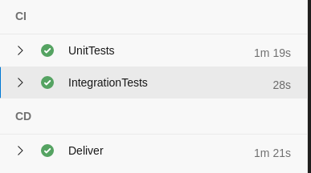
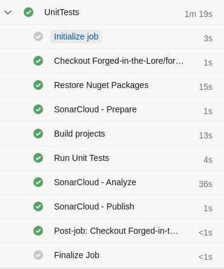
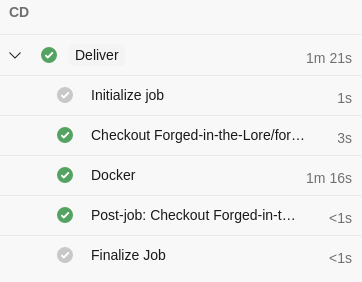
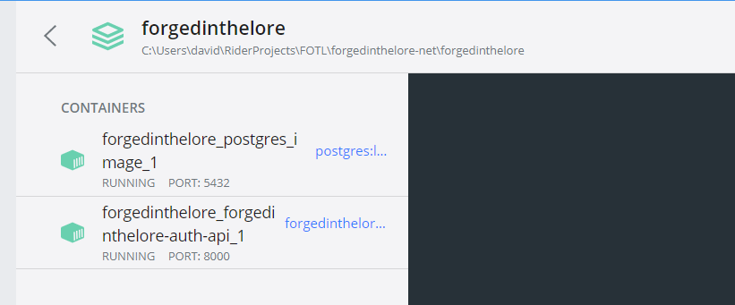

# CI/CD

See [Azure](https://dev.azure.com/OIBSS-F/Forged%20In%20The%20Lore/_build) for the pipeline runs and code.

My primary pipeline is the one for the .NET Project [forgedinthelore-net](https://dev.azure.com/OIBSS-F/Forged%20In%20The%20Lore/_build?definitionId=23). It consists of two stages: A CI stage where all tests are run, and a CD phase where delivery to Docker Hub happens.

## CI

The CI stage consists of two jobs: First Unit Tests are run. Then, if the Unit Tests pass, Integration Tests are run, and if those pass the stage is successful.

The Unit Tests job checks out the code and prepares it to be built. Then, SonarCloud - my static code analysis tool - is prepared and configured, and the project is built. After building, my tests are run - including code coverage - with the results published for SonarCloud to use.

SonarCloud then analyzes the built project - looking for code duplication, vulnerabilities, etc. - and generates a report which it publishes to [SonarCloud](https://sonarcloud.io/project/overview?id=OIBSS-F_Forged-In-The-Lore).

Once the UT job passes the pipeline moves on to Integration Tests. Or at least it does in theory. Due to time limitations I didn't write any integration tests - and thus the stage currently just runs an auto-passed test file. The current form serves to demonstrate dependency between jobs.

## CD

Delivery is currently done to Docker Hub. I decided against actual deployment mainly due to the time it would take.

For my backend I managed to get Docker to work properly: I can run a networked postgres server with the Auth API docker container via docker-compose and the API properly uses the database. This is not currently being properly delivered/deployed though.

As for my Angular front-end: Angular doesn't innately support using environmental variables to store things like API URLs since the built version of the website is static. I tried implementing a few solutions that would allow me to configure the URL via Docker environmental variables (such as [this](https://www.c-sharpcorner.com/blogs/dynamic-configuration-of-angular-api-url-using-docker-compose-yml-file)) but none of those seemed to work - most likely due to my own failings.
