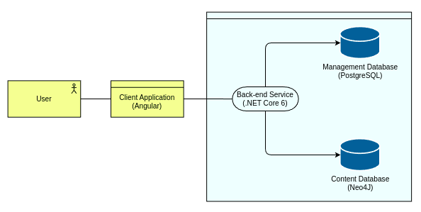
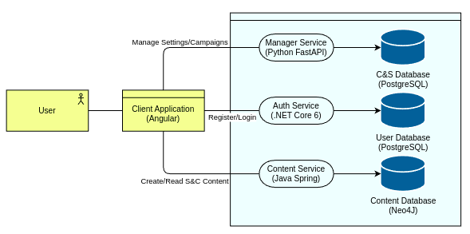
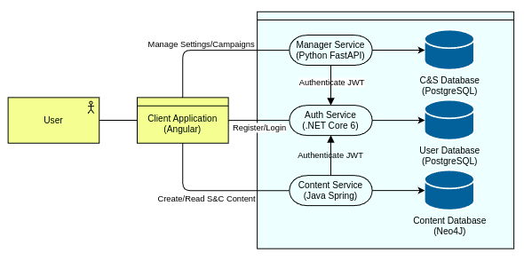

TODO: Design documentatie met argumenten - waarom doe je dingen? Focus meer op het proces

Project vanaf de andere kant aanpakken - eerst voor core functionaliteit, dan pas dingen als login

# Initial Concept

Forged in the Lore will be a webapp for tabletop RPGs with a focus on Blades in the Dark and Legends of the Wulin. It will allow Storytellers to track factions, characters or any other type of entity, the information about those things and the relations between them.
Storytellers will be able to create setttings to store their worlds in. They can then create entities of different types, set what properties an entity has and define relationships between them. They will be able to control what players can or can't see. They can then create a campaign that is based on a setting they have which is where players gain access to the lore. The campaign will use the lore from the setting plus it's own campaign specific lore. ST's can give players the option to "buy" information via a "Lore Point" purchasing system. The players will only be able to see information that the ST has made available or that the player has bought.

[Azure DevOps Board](https://dev.azure.com/OIBSS-F/Forged%20In%20The%20Lore/_boards/board/t/Forged%20In%20The%20Lore%20Team/Features) with User Stories.

# Architecture
Throughout the project I went through multiple architecture designs. Here I will be describing those and what lead to the changes. Technical choices will be mentioned but reasoning for those can be found in the chapter [Technical Choices](#technical-choices)

## v1 - Single Back-end

Based on the initial concept I decided on a two part system - A front-end client application with Angular and a back-end with .NET that would handle all back-end requests. This back-end would have used two databases: First, a PostgreSQL database for users and top-down data of settings and campaigns. Second, a Neo4J graph database to store the actual lore.

This initial architecture didn't have much though put into it - it was just the most simple architecture available - and quickly turned out to be a bad design. It relied on a monolithic system which limits scalability, creates a massive single-point-of-failure and goes against many modern software design principles.

## v2 - Splitting responsibilities

To improve FOTL's architecture I decided to split the back-end up into multiple parts based on responsibilities. I didn't commit to a full microservice architecture but split the system into three parts.

The first component would be an authentication service - responsible for user account related functionality. Second there would be a management service that handles top-down management of settings and campaigns such as creating settings, linking campaigns or inviting players. Third would be the actual content service that would handle the setting and campaign lore.

### v3 - Authentication

Although the second architecture was acceptable I ran into a question: How do I do authentication when only my Auth Service knows how to decrypt the JWT the client has?
Do I just share the secret key? To answer this I did some research on authentication with multiple services and based on that [research](../Research/JWT-Authentication-with-Multiple-Services.pdf) I decided to expand my Auth Service to be able to validate JWTs so my other services could rely on it which gave me the following final architecture.

# Technical Choices 

In this section I will be detailing the technologies I chose to use and the reasoning for that.

## .NET Core - Auth Service

I chose to go with .NET Core for my Auth Service - and the whole back-end in the initial architecture - due to having some familiarity with it. I wanted to focus on expanding that knowledge while working on other aspects of the project instead of diving head-first into a new language. In addition to that EF Core Identity would allow me to have a robust account system while leaving the complex - and risky - parts of account management to a library.

## Angular - Client WebApp

Similar to .NET Core I chose Angular due to having some familiarity with it - although I had less experience with it than with .NET - and wanting to expand that knowledge. For my group project we had decided on Vue which I had also used last semester, and I had previously worked with React and disliked the way it's structured.

## Java and Neo4J - Content Service

For my Content Service I did some [research on graph databases](../Research/Graph-Databases.pdf) from which I concluded I'd be using a Neo4J graph database to store my lore in. This lead to the question which language to build the service in to support Neo4J and that makes Java the obvious choice since it's the only one with an OGM - Object Graph Mapper, the graph database version of an ORM - available. Since I was open to learning more languages I decided adding Java to the stack was acceptable.

## Python - Management Service
For my management service I wanted to chose a new language to work with. Since I was planning to go with Java for my Contect Service and .NET for my Auth Service Python seemed like a good option. The system is relatively simple - mainly basic CRUD operations - so it would be a perfect chance to work with Python. I looked into the available API packages and decided to go with FastAPI with SQLAlchemy.

## PostgreSQL
I chose PostgreSQL as my database language due to two aspects: it's the only major SQL framework that's fully open-source and it's supported by Heroku in case I want to deploy there.
