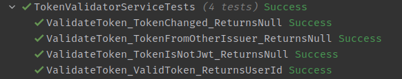

# Testing Plan

To assure quality of both code and design various forms of testing can be applied. In this chapter I will be going over the different test types I will be using in this project. For each I will detail how and why I plan to use them. Note that I will not specify the exact tests here.

## Functional Tests

Functional tests focus on the question: Does the code do what it should do?

### Unit testing

The first and most granular form of testing is unit testing. Unit testing is involves testing individual functions within the code. It is most important when a part of the code contains custom logic - there's not much of a reason to test something that just uses a standard library. To do this we mock (or stub) any dependencies the functions have so we can test only what the function does without any external factors impacting it.

Most of the FOTL application is basic CRUD operations or operations that require a wider scope to test - and will thus be tested via integration and system tests. Unit tests will be used sparingly when a piece of code justifies it.

### Integration testing

Integration tests focus on the interfaces and interactions between components. The scope of the tests can vary based on testing method and phase - some integration tests might be limited to the interaction between a few classes within a single application, while some span multiple micro-services or include the database (src: [atlassian](https://www.atlassian.com/continuous-delivery/software-testing/types-of-software-testing)).

For FOTL I will be using a form of Big Bang Testing - a strategy where all components/modules are tested together. Specifically i will be testing the controller-repository-database stack. This will be done both locally and as part of my CI pipeline, by deploying a test database and running the tests against that. These tests will ensure that any changes to the APIs are tested.

Big Bang testing is a viable strategy mainly due to the scale of the project. I have only a few small systems which makes it a convenient strategy that is simple to implement while minimizing the downside - the difficulty of fault localization.

## Contract testing

Although I thought of using contract testing it is much too complicated for the time I have and thus won't be part of this project.

## Acceptance Tests

Acceptance test focus on the question: Does the application do what it should do?

### End-to-End testing

End-to-end tests verify that the complete system does what it's supposed to do and does it correctly by simulating user behavior. In the case of FOTL this will be done with Selenium. After functional tests have passed the pipeline will deploy the service to the test environment - an azure webapp - and then the Selenium tests will be run against that. Tests will focus on happy flow and "dangerous" unhappy flows that require proper handling due to for example security - eg attempting to log in with an incorrect password.

### Acceptance testing

Acceptance tests will be executed manually on a user-story basis. These will encompass the acceptance criteria of the user story as well as testing usability of the newly added functionality.

# Static Code Analysis

Besides testing an important aspect of software quality is static code analysis. There are a bunch of tools that can be used for static code analysis - I decided to use SonarCloud - a popular cloud based SCA tool that is free for open-source projects - and it's offline version SonarLint which runs directly in my IDE. SonarCloud runs automatic analysis as part of my CI pipeline and publishes the result to a public [SonarCloud Dashboard](https://sonarcloud.io/project/overview?id=OIBSS-F_Forged-In-The-Lore).

So what does Sonar do? It has three different aspects on which it analyzes the committed code based on a massive set of rules and patterns. A so called Quality Gate - a set of requirements for the analyzed aspects - is then used to determine if the code is good enough. This quality gate can then be used to decide on steps later on in the pipeline, such as rejecting a merge. The aspects are as follows:

1. Reliability: a measure of how likely the code is to not do what you expect it to do. This covers many things such as known bugs or unreachable code. This looks at what the code does and how it would run.
2. Maintainability: a measure how easily the code can be maintained. Covers everything from code complexity and duplication to test coverage and "code smells" - code that doesn't comply with coding standards.
3. Security: Analyzes code for known vulnerabilities and security-sensitive elements and suggests fixes for those issues. Covers most of the OWASP Top 10.

By setting a quality gate, running a tool like SonarCloud and fixing the issues it finds we can improve the quality and security of code - but not the usability.

# The Reality

We have a test plan - but which parts of it where actually implemented?

Testing was a weakness of this project - I started way too late, instead of just writing tests as I worked on the actual stories, and didn't have time for most of the planned tests. I ended up having to decide what types of tests to implement. End-to-end testing was ruled out due to the time necessary to set up a proper test deployment on which to run the E2E tests - since those would require a fully functional stack. Acceptance tests aren't interesting because of how little of the application I ended up implementing - there isn't much more than an account system.
So Unit Tests vs Integration Tests? As detailed above UT are interesting for parts of the application where the logic itself is what we want to test, while IT are relevant if we want to test that the interaction between components or systems works as expected. For the registration/login part of the auth service IT is more relevant: it's mostly a front for database interaction that heavily relies on EF Core Identity and other libraries for it's logic. The other part of the auth service I completed is the token validation service which I can use to authenticate user requests to other APIs. This relies more on logic and data structures I created and is worth testing by itself. Since I'm pressed for time I decided to write unit tests for the token validation service.

These UT are run as part of my CI/CD pipeline.
