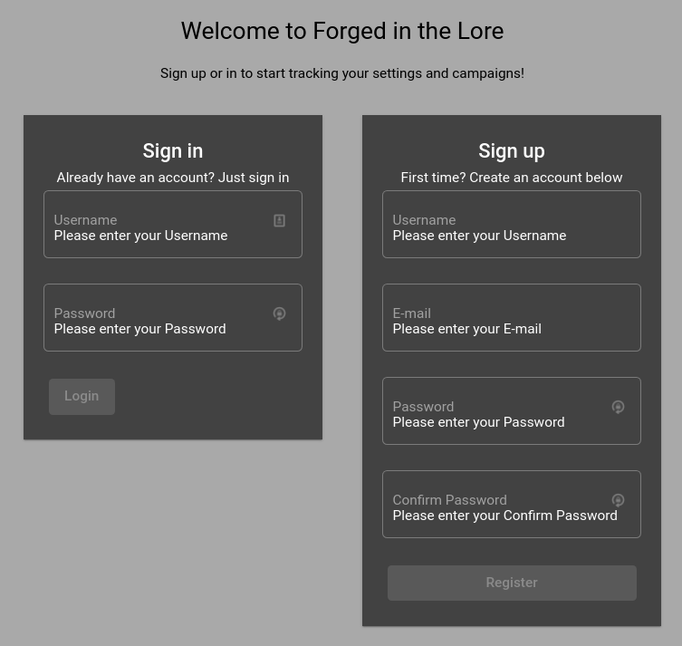

# Web Application

Please see the [Repository](https://github.com/Forged-in-the-Lore/forgedinthelore-ng) for what I did website wise for IP. The most interesting parts are the Interceptors and Services. Also see what I did in the [Group Project](../../Group-Project/Web-Application/README.md)

## APIs

There are two backend APIs. Exports of the Swagger docs can be found in the PDFs [Auth Service](swagger_auth_service.pdf) and [Management Service](swagger_auth_consumer.pdf)
