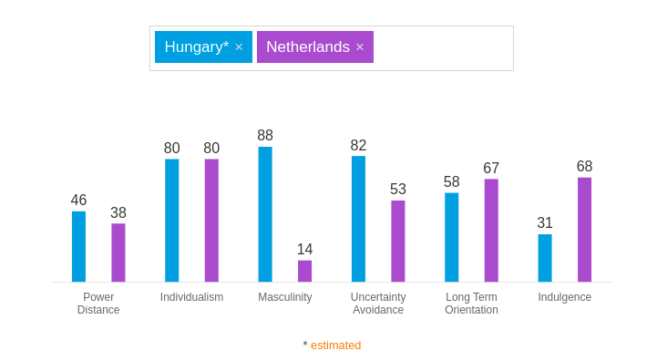

**Note** Since our project lacks options to reflect on cultural differences and ethics I will instead be reflecting on my own experiences based on the workshop we had about this subject.

##Cultural Differences
I grew up in Hungary and only moved to the Netherlands when I was 18 to go study. In many aspects Hungarians are very different than Dutch people and although my parents were Dutch - and in my private life I had been raised with a Dutch mentality - at school I had learned the Hungarian way of thinking and working. From here on we will take a look at a few different types of cultural differences and how I encountered them when moving to the Netherlands.

##Hofstede's Cultural Dimension Theory
[Hofstede's cultural dimensions theory](https://en.wikipedia.org/wiki/Hofstede%27s_cultural_dimensions_theory) is a model of cultural values in different countries developed by Geert Hofstede. One of the purposes of the model is to give numerical values to certain behavioral and cultural traditions which impact cross-cultural relations and thus create awareness of the differences between people, allowing for respectful cooperation and communication between people of different origins. One important thing to realize is that the model uses national preferences to describe people. Although this can be a good indicator there are many things it doesn't account for such as gender - Masculinity score doesn't actually account for gender, instead looking at a society by whether they value traits that Hofstede categorized as masculine or feminine - as well as differences between regions or organizations among other things.
*The HCDT indexes of Hungary and the Netherlands.*

_**Source:** the following definitions and the image above are taken from the [Hofstede Insights](https://www.hofstede-insights.com/country-comparison/hungary,the-netherlands/)_

### 1. Power Distance Index
_"The extent to which the less powerful members of organizations and institutions (like the family) accept and expect that power is distributed unequally. A higher degree of the Index indicates that hierarchy is clearly established and executed in society, without doubt or reason. A lower degree of the Index signifies that people question authority and attempt to distribute power."_

The difference in PDI is relatively small - NL 38 vs HU 46. My own experience is limited in this since it mostly shows itself in a family or work environment. I can only compare school in HU to university in NL - which inherently is quite different due to the type of education. One very noticeable difference is the form of address and required respect when approaching teachers/professors. Hungary is quite formal when addressing superiors or those perceived as higher in the hierarchy. Teachers were to be addressed with "ön" - the equivalent of the Dutch "u". This was true even for teachers who we had known for years. October of 2021 I went to Hungary and met with one of the mentors of my former class who we still address that way. On the other hand when I arrived in the Netherlands to study at university and approached the professor while using "u" I got a weird look and was told to just use "jij". It took some time to get used to the informality but by now it has become my standard. While working in tech-support one of our client companies was a law firm that expected us to address them formally which at that point felt very weird and was something we stopped doing over time.

### 2. Masculinity
_"A high score (Masculine) on this dimension indicates that the society will be driven by competition, achievement and success, with success being defined by the winner / best in field – a value system that starts in school and continues throughout organizational life.
A low score (Feminine) on the dimension means that the dominant values in society are caring for others and quality of life. A Feminine society is one where quality of life is the sign of success and standing out from the crowd is not admirable."_

This is a very noticeable difference in the way education works in these two countries. In the Hungarian school system there's a very heavy emphasis on not just performing within school but - if you are any good at a subject - participating in regional or national competitions in that subject. I was pretty good at math and thus I and some classmates participated in multiple math related competitions starting from second grade of grade school (age ~8) while others did this for history or literature. I was far from a genius when it came to math but even so it was expected that I would participate in these competitions and when trying to get into a good high-school this was also taken into account. Since I don't have first hand experience with the Dutch system I can't say that much about how it is here but to demonstrate the difference: there don't seem to be any national math competitions for lower education in the Netherlands that don't serve as a selection round for an international competition - of which there are two. In Hungary a quick search reveals 25 different competitions for lower education that have no international follow up. This obsession with competition was also obvious in other things such as sports. In the Netherlands it is pretty normal that kids participate in sports for fun. In Hungary most sports clubs are very focused on competition with no option to just play for the sake of playing. Many places require training three or more times a week and have mandatory participation in tournaments at least once per month. 

As for work environments one of the more noticeable differences is the flexibility of work in the Netherlands. It is very normal for people to work four days a week and there's a lot of emphasis on work/life balance. Consensus is also very important when making decisions, both in the workplace and in politics - the term "polderen" is used for "the Dutch way" of making decisions where all parties sit around a table and discuss the issue until they reach a compromise.

### 3. Uncertainty avoidance
_"The extent to which the members of a culture feel threatened by ambiguous or unknown situations and have created beliefs and institutions that try to avoid these"_

Hungary has a noticeably high uncertainty avoidance - there's strong resistance to change throughout society. In education this outs itself in the material that is taught - often very factual and rigid with little time spent analyzing and learning to think about things and a heavy emphasis on memorizing. In society this can be seen in the rejection of some modern, progressive ideas that would for example impact social standings.

In the workplace this outs itself in the rigidity with which people stick to the task they were given. One of the issues we always had is that a Dutch contractor, when given instructions that they disagree with - will often speak up about the issues they see and are willing to work towards a better solution. Most Hungarian contractors will do whatever they were told to do - no matter how idiotic or badly designed. There's a mentality of doing what you were to do because then it's not your responsibility if the instructions were bad - if you cause the plans to change and something goes wrong you'll get the blame.

An interesting thing is that though Hungary scores high on UA, Masculinity and Indiviualism, which should mean that Hungarians are hard working and focus on punctuality, performance and perfection while taking individual responsibility, this is not necessarily the case. Many Hungarians are often late - we were the weird ones for always being there a few minutes early - and many jobs seem to suffer from a "just get it done" mentality that is often reflected in the quality of the end product or service.

