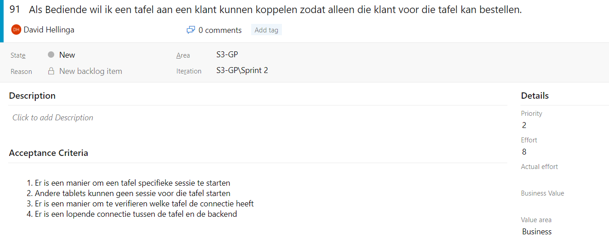

#Agile method
##1. Choosing a method
To decide on what agile method we would use for this project group we started by researching popular options. For the research see the accompanying file [Agile Onderzoek](Agile%20Onderzoek.pdf). My personal contributions to this where the initial setup, research questions and the headings marked with my *name*.
 Based on this research we chose to go with Scrum.

##2. Implementing Scrum
Since I had previous experience working with Scrum - and was already the unofficial team leader - I took on the role of Scrum Master for the first two sprints after which we started switching roles so everyone could learn.

The basis of Scrum is the use of User Stories to specify requirements for software and the processes surrounding these stories that let the customer and developers iterate on and implement them. Thus, one of the first things we did for the project was decide on an initial set of user stories based on requirements of the client. We wrote these as a team by going through what amounts to a storyboarding session (but without the actual board). We went through the user experience process and based on that we described the user's requirements. These user stories were then saved in a [DevOps](https://dev.azure.com/OIBSS-F/S3-GP) project I set up so we could easily track them.

We also added Acceptance Criteria to the user stories we were planning to pick up in early sprints and estimated the effort these stories would require via planning poker. Starting from the second sprint we also wrote tasks for each user story and estimated those instead to get a more accurate picture of what a story entails and how much work it would be.

##3. The Cycle
###3.1 Sprint planning
We start each three week sprint with a sprint planning session. Here we determine the exact stories we are going to be working on - based on client feedback - and specify the tasks that those stories require. We then estimate those tasks to have and adjust the stories we plan based on those estimates. This gives us a clear idea of what we will be doing in the sprint and, at the end of it, allows us to reflect on how we performed in comparison to our expectations.
###3.2 Daily Stand-up
We start each day with the daily stand-up where each team member describes what they have done, what issues they had and what they are going to do. For the first sprint we did this rather loosely but after that we started focusing more on which pre defined tasks we had worked on based on the current sprint board.
###3.3 Sprint Review
After three weeks of working on the planned stories the sprint ends with a Sprint Review. We sit down with the client, show them what the current status of the project is, what we did or didn't implement and discuss how they feel about it and what we should focus on in the next sprint. Important is that this is not just a demo - the focus is on the dialogue with the client. After all, one of the main goals of Agile is to adjust to client requirements. I personally did most of the [sprint 0 review](Oplevering%20Sprint%200.pdf).
###3.4 Retrospective
After the Review comes the Retrospective where the team reflects not on the product but on the process of creating it. We did this by looking at what things we noticed this sprint - what went well, what didn't. Based on that we decided on things we would start, stop and continue doing. As an example see the [Retrospective for Sprint 1](https://dev.azure.com/OIBSS-F/S3-GP/_apps/hub/ms-devlabs.team-retrospectives.home?teamId=a0a88eb5-85ef-43b2-9cb4-7feb62a771fb&boardId=0daddb64-931a-4203-8951-9efd22e5181b).

##4. Reflection
