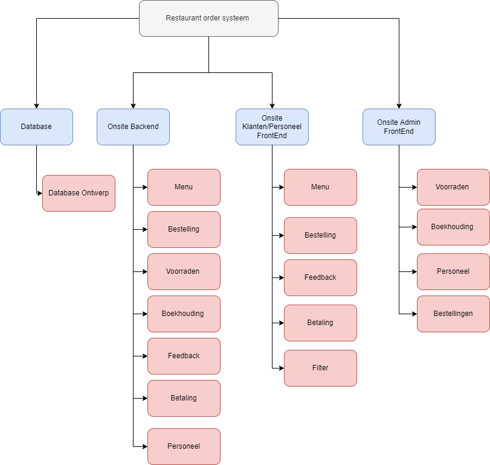

Our original project breakdown structure involved three software components:
1. The backend responsible for most of the applications logic and linking the different components together.
2. The frontend for customers and staff in which customers could order and staff could track said orders.
3. The admin frontend for managing the menu and administration.

These would all run of of a single database.

