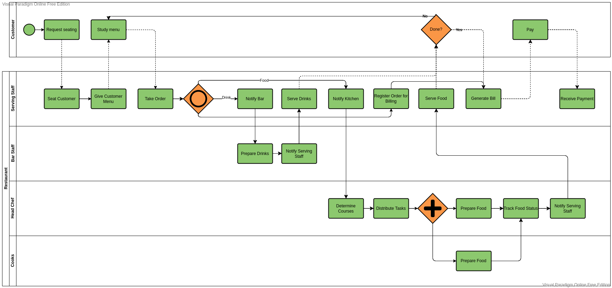
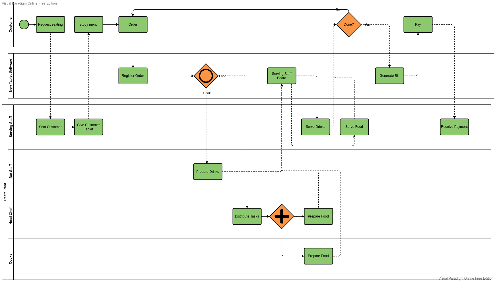

# Business Processes
In this document we will be taking a look at one of the business processes that the digital menu will change and what effect that has. We will first go over the current process and it's weaknesses. We will then take a look at what our application can change about that process and how that impacts the business as a whole.
## The Current Process
The basic process that our software impacts is a customer's experience at a restaurant. This starts at arrival and ends once the customer has paid as seen in the BPMN chart below.

_Basic order process without digital menu_

There are a few obvious points where this process could be improved:
1. A lot of work is spent simply passing data between different participants - mainly on the part of the serving staff. Every time the customer wants something serving staff is required to get the information and act on it or pass it on to the relevant participant. This also means that when the serving staff is not available other - time intensive - activities cannot be started. It also creates a point of failure that can impact customer satisfaction if orders are incorrect.
2. Ordered products have to be manually registered for billing by the serving staff. This means that mistakes in this step can lead to something not being billed.
3. The head chef has to spend time analyzing incoming orders and determining how courses should be structured which takes time away from the main task of the kitchen.

## The Future Process
So how will our software change this process? Lets start with the graph after the software is introduced.
_Basic order process after introduction of digital menu_
What changed about the previously mentioned possible improvements?
1. Most of the communication is offloaded to the tablet software. This is automatic and thus eliminates waiting times, minimizes chance of mistakes and saves the serving staff a lot of time.
2. Registration of products is automatically done by the software when the customer orders it. This means that everything that was ordered is registered in the system and will be billed.
3. Courses are pre-determined, allowing the chef and cooks to focus on preparing them.

## Overall impact
The introduction of the tablet software cuts out a lot of overhead for staff, allowing the restaurant to function with fewer employees - something quite important in times when staff is difficult to find. Besides that the automation of registration and communication increases the reliability of the process by eliminating possible errors.
The software does of course introduce a new point of failure: The software itself. For this process it is relatively easy to switch back to the old system temporarily meaning that this would not lead to a halting business.

