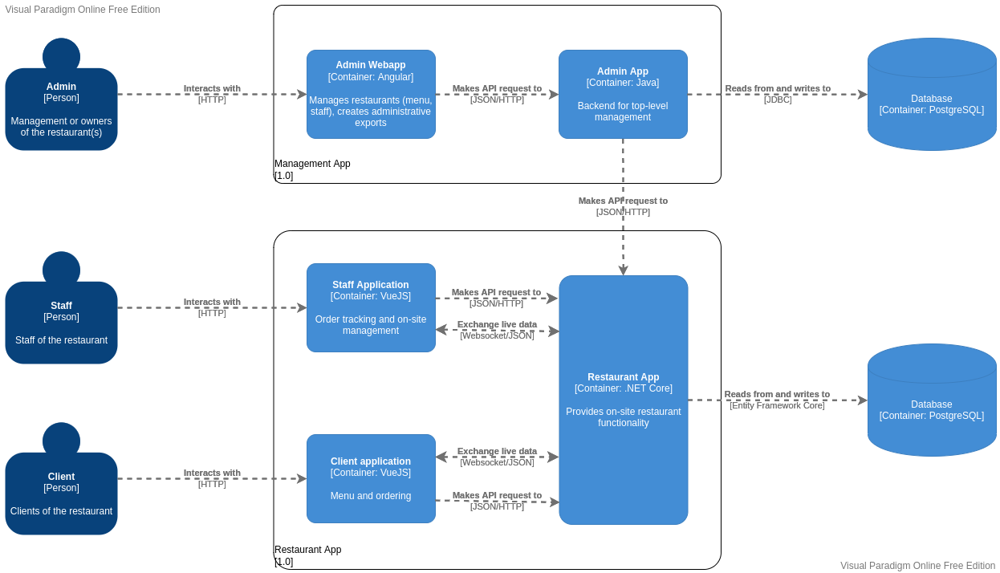

# Architecture

Based on the customer's requirements we decided to use two systems: An on-site restaurant app and a separate administrator app.

The core daily functionality is encapsulated in the on-site components.  A single back-end handles providing the menu and tracking orders while two front-ends make use of it: one for clients and one for staff. The database is also ran on-site. The client and staff applications are separated - mostly a security measure - but both run as static websites served by the restaurant app.
 There are a few reasons to have an actual on-site system:
   1. It makes the system independent of any internet related issues thus increasing availability
   2. Increases security by allowing deployment on its own closed network, keeping client devices separate.

The management app is a single instance - hosted in the cloud - that manages all linked restaurant apps. This way extra restaurants can easily be deployed without having to change the management system's architecture, and the management system can be easily accessed by users outside the restaurant - for example an external accountant.
