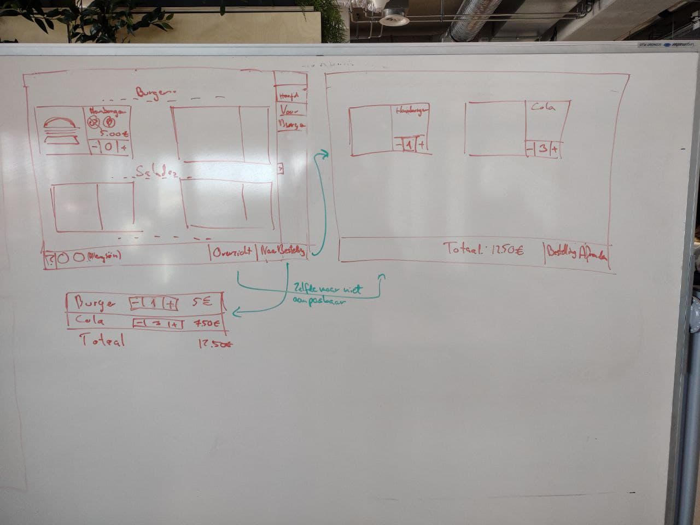
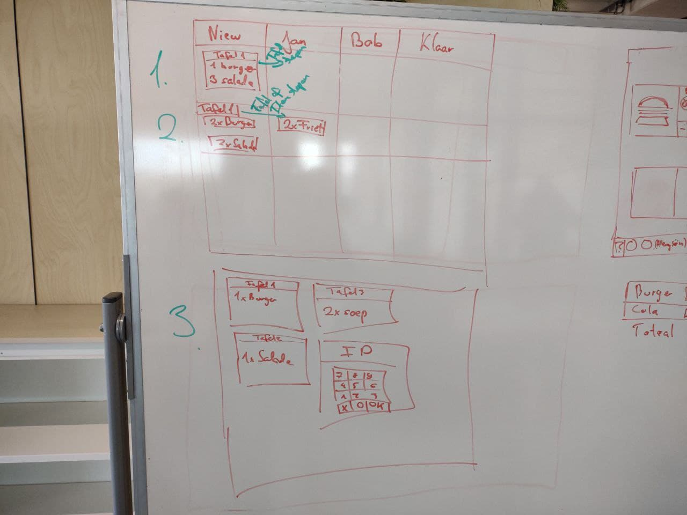
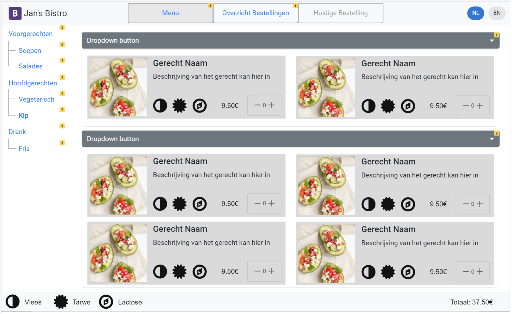
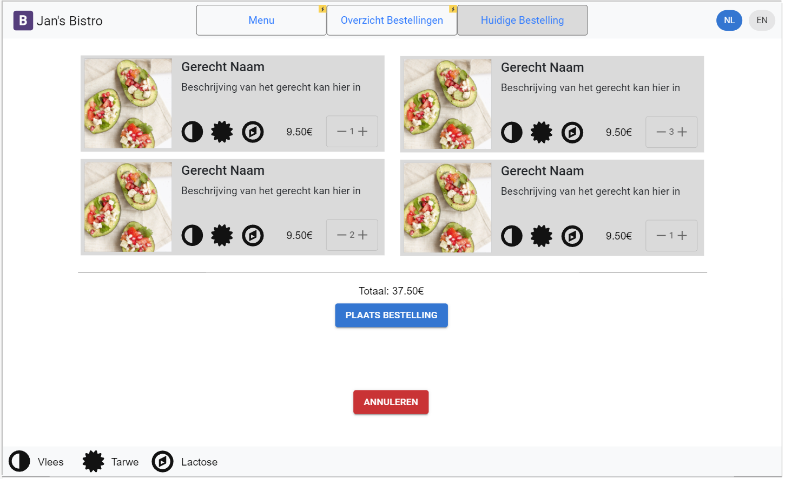
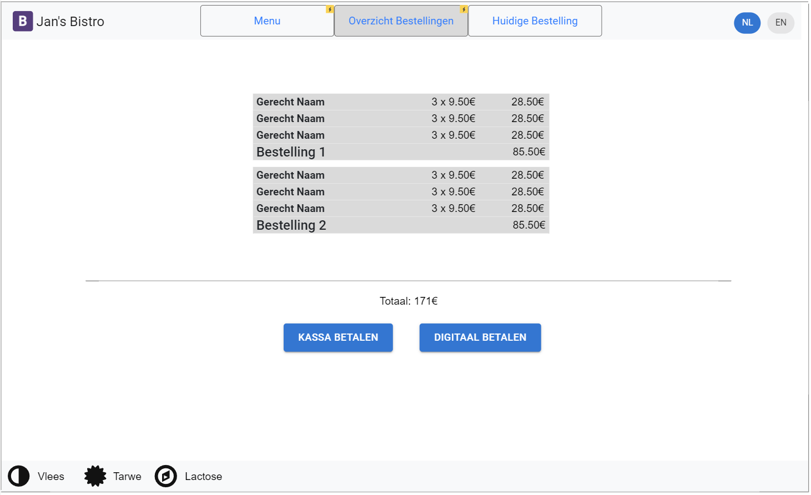

## UI and UX design
For the UI/UX I designed the original set of sketches based on discussion within the project group. I then turned these into rough wire-frames. See these [below](#wire-frames-and-sketches).

## UX Research
UX Research is one the weaknesses of our project. We should have started the project by using different research methods to design UX that is intuitive and compliant with not only the client's wishes but also that of potential end-users. We did not do this and thus we are left with testing at the end.

TODO: Use application as it is at the end of Sprint 4 to test user experience. User friendly: You apply basic User experience testing and development techniques.

## Wire-frames and Sketches
### Original Wire-frame Sketches

###The Menu

###Current Order

###Overview of Orders

