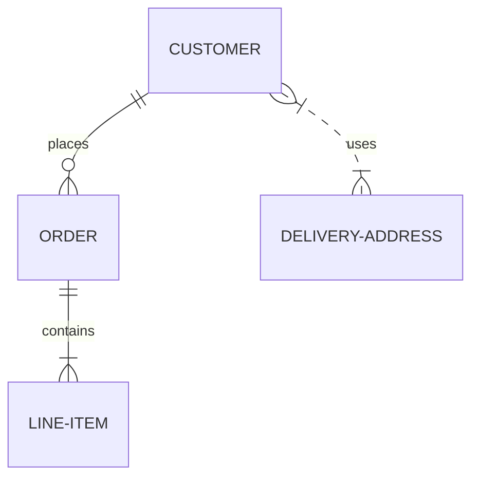
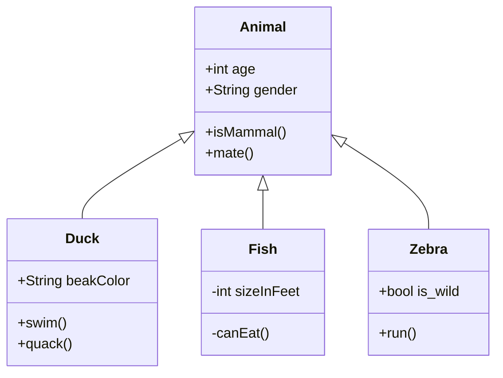

SWritten in Atom with [Markdown Preview Enhanced](https://shd101wyy.github.io/markdown-preview-enhanced/#/) and [Mermaid](https://mermaid-js.github.io/mermaid/#/)

```mermaid
erDiagram
    CUSTOMER ||--o{ ORDER : places
    ORDER ||--|{ LINE-ITEM : contains
    CUSTOMER }|..|{ DELIVERY-ADDRESS : uses

```

```mermaid
classDiagram
     Animal <|-- Duck
     Animal <|-- Fish
     Animal <|-- Zebra
     Animal : +int age
     Animal : +String gender
     Animal: +isMammal()
     Animal: +mate()
     class Duck{
         +String beakColor
         +swim()
         +quack()
     }
     class Fish{
         -int sizeInFeet
         -canEat()
     }
     class Zebra{
         +bool is_wild
         +run()
     }
```
